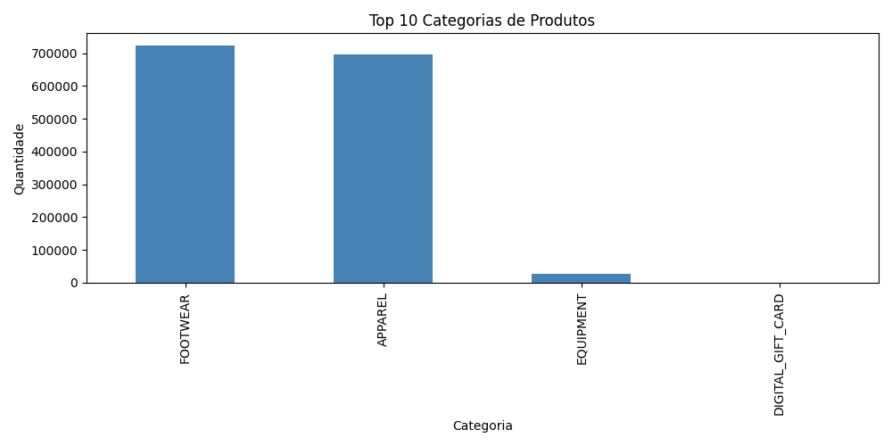
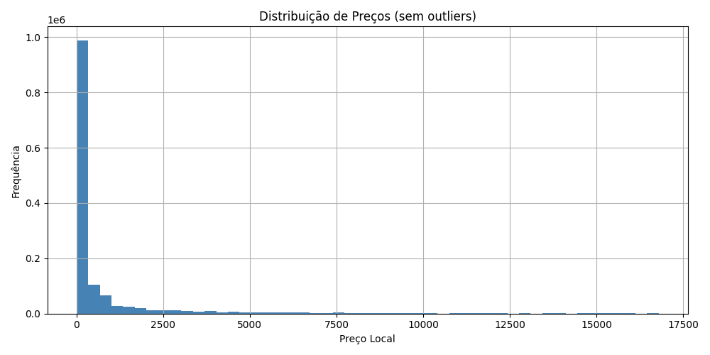
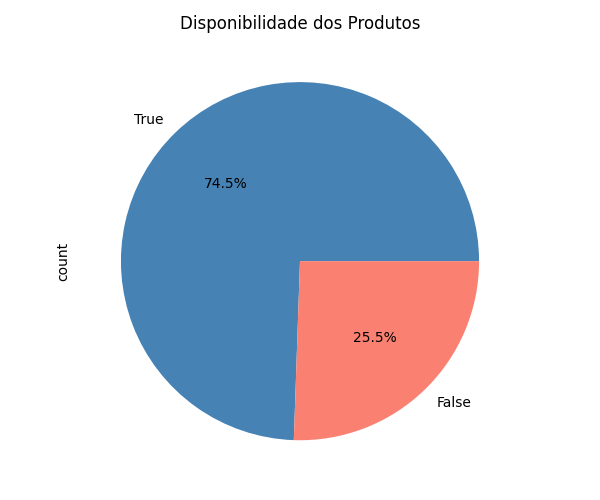
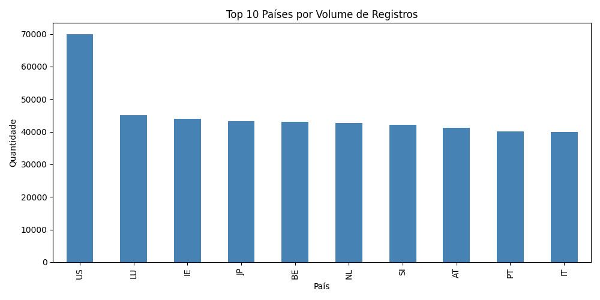
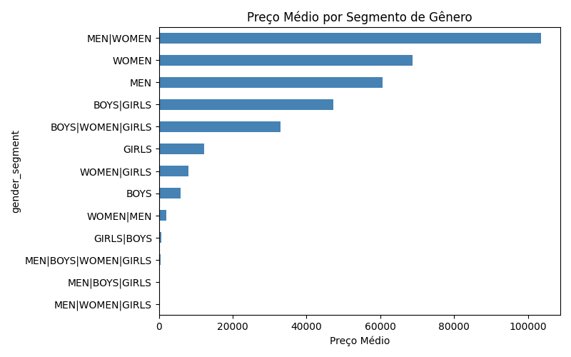

# Lab01_PART1_SEUNUSP

## Descrição
Pipeline de ingestão de dados End-to-End utilizando o dataset Nike Global Catalogue 2026 (45 países)

---

## Arquitetura
```
Kaggle 
    ↓ kagglehub
data/raw/ (Bronze) — 46 CSVs
    ↓ pandas + limpeza
data/silver/ (Silver) — nike_silver.parquet
    ↓ sqlalchemy
PostgreSQL (Gold) — Star Schema
```

## Dataset
- **Nome:** Nike Global Catalogue 2026
- **Fonte:** [Kaggle - bsthere/nike-global-catalogue-2026](https://www.kaggle.com/datasets/bsthere/nike-global-catalogue-2026)
- **Linhas:** 1.447.795
- **Colunas:** 35
- **Países:** 45
- **Tamanho:** ~1,68 GB

## Dicionário de Dados

| Coluna | Tipo | Descrição |
|---|---|---|
| snapshot_date | datetime | Data de captura do dado |
| country_code | string | Código do país |
| product_name | string | Nome do produto |
| model_number | string | Código do modelo Nike |
| currency | string | Moeda local do país |
| price_local | float | Preço atual na moeda local |
| sale_price_local | float | Preço promocional (0 = sem promoção) |
| gender_segment | string | Segmento de gênero (MEN, WOMEN, KIDS) |
| size_label | string | Tamanho do produto |
| category | string | Categoria principal |
| subcategory | string | Subcategoria |
| product_id | string | Identificador global do produto |
| sku | string | Código SKU por tamanho |
| brand_name | string | Nome da marca |
| available | bool | Disponibilidade em estoque |
| availability_level | string | Nível de disponibilidade |

## Qualidade de Dados

| Coluna | Problema | Decisão |
|---|---|---|
| gtin | 100% nulos | Coluna removida |
| size_count | 100% nulos | Coluna removida |
| available_size_count | 100% nulos | Coluna removida |
| employee_price | 100% nulos | Coluna removida |
| sale_price_local | 85.4% nulos | Preenchido com 0 (sem promoção) |
| gender_segment | 0.5% nulos | Linhas removidas |
| size_label, sku, subcategory | < 0.01% nulos | Linhas removidas |

## Modelagem Gold (Star Schema)
```
fato_preco
    ├── dim_produto  (product_id, product_name, category, subcategory, brand_name)
    ├── dim_pais     (country_code, currency)
    ├── dim_segmento (gender_segment)
    └── dim_tamanho  (sku, size_label)
```

## Métricas de Negócio

1. Categoria com maior volume de produtos
2. Países com mais produtos indisponíveis
3. Desconto médio por categoria
4. Preço médio por segmento de gênero
5. Produtos presentes em mais países

## Gráficos







## Instruções de Execução

### 1. Instalar dependências
```bash
pip install -r requirements.txt
```

### 2. Configurar PostgreSQL
- Instalar PostgreSQL localmente
- Criar banco de dados: `nike_lab`
- Usuário: `postgres` / Senha: sua senha

### 3. Executar scripts na ordem
```bash
python scripts/bronze.py
python scripts/silver.py
python scripts/gold.py
```
